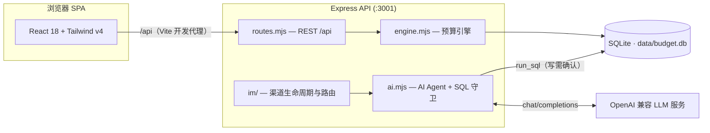

<div align="center">

# 四季豆预算 · Al1abb Budget

**基于 Xiaowen Budget 的个人自用版，实现更多个性化功能**

[](./LICENSE)

> 本项目 Fork 自 [Xiaowen Budget](https://github.com/iamshaynez/xiaowen-ynab)，感谢原作者的开源精神。

</div>

---

四季豆预算是一套完全运行在你自己机器上的零基预算（Zero-based Budgeting）工具：账本、预算、报表、AI 助手全部落在一台设备上的单个 SQLite 文件里。它遵循 YNAB 四法则——给每一块钱一个任务、拥抱真实开支、灵活应变、关注资金账龄，并把「AI 直接替你查账、记账」作为一等公民：AI 助手通过受控 SQL 工具读写你的本地数据库，所有写操作必须经你确认；你还可以把同一个助手接入 Telegram 与个人微信，随时随地在聊天软件里记账。

## 功能特性

### 预算
- **待分配金额（Ready to Assign）**：收入进账后逐月分配到分类，直到归零
- 按月分配、移动资金、弥补超支、一键复制上月预算
- 分类目标：按目标日期储蓄 / 按余额目标储蓄，「一键分配至目标」自动补齐差额
- 资金账龄（Age of Money）、超支与未分类交易提醒

### 账户
- 支票 / 储蓄 / 现金 / 信用卡 / 信用额度 / 投资 / 房产 / 车辆 / 各类贷款等资产与负债类型
- 预算内 / 预算外账户，支持关闭账户
- 信用卡消费自动从还款科目划扣额度，向信用卡转账即为还款

### 交易
- 收入 / 支出 / 转账三合一录入；转账双分录自动配对，幂等不重不漏
- 批量分类、批量删除、快速清算、对账（reconcile）
- 退款记回原支出分类，抵减支出而非计入收入

### 报表
- 净资产走势、收支趋势、支出构成、Top 商家、收入来源

### AI 助手
- 对话式记账与查账：「记一笔午饭 35 元」「上个月餐饮花了多少」由 AI 生成 SQL 直接操作本地数据库
- 兼容任意 OpenAI Chat Completions 接口的服务，Base URL / 模型名 / 密钥均可在设置页配置
- 只读查询自由执行；**任何写入操作强制弹窗确认后才会执行**
- 会话历史持久化；回复支持 Markdown 与 Mermaid 图表渲染

### IM 渠道
- **Telegram Bot**：长轮询接入，配置 Bot Token 即用
- **个人微信**：扫码登录（ilink bot 协议），收发文字消息
- 多会话管理、待确认写操作跨重启持久化、消息游标断点续拉不丢消息
- 在聊天里回复「确认 / 取消」即可审批写操作，`/new` 开启新会话

### 每日备份
- 每天定点自动备份 SQLite 数据库（在线快照 + gzip），不锁库不影响使用
- 远端可接入任意 S3 兼容对象存储（如 **Cloudflare R2**），内置 SigV4 签名直传，无需额外依赖
- 本地 `data/backups/` 与远端各保留最近 7 个版本，旧的滚动删除
- 支持手动「立即备份」与远端连通性测试；错过时刻（宕机等）重启后自动补跑

### 其他
- 可选密码登录（JWT 签发，恒定时间比较防时序侧信道）
- 中英双语界面，自定义货币符号
- 一键载入示例数据体验完整功能

## 技术栈

| 层      | 技术                                                             |
| ------- | ---------------------------------------------------------------- |
| 前端    | React 18 · TypeScript (strict) · Vite 6 · Tailwind CSS v4 · Recharts · Mermaid |
| 后端    | Node.js 20+ · Express 4 · better-sqlite3                         |
| 数据    | SQLite 单文件（WAL 模式）· 版本化迁移，启动即建表                |
| 测试    | Vitest（服务端 node 环境 + 组件 jsdom 环境）                     |
| CI      | GitHub Actions：typecheck + 全量测试                             |

## 架构



同一套 Agent 会话层同时服务网页聊天与 IM 渠道；引擎中的预算计算（`goalNeed`、`ageOfMoney` 等）保持纯函数，可脱离数据库单测。

## 快速开始

环境要求：Node.js 20+。

```bash
git clone https://github.com/shunichio/budget.git
cd budget
npm install
npm run dev
```

打开 <http://localhost:5173>（API 跑在 `:3001`，Vite 自动代理 `/api`）。首次进入空账本时，可以点击「载入示例数据体验」快速上手。

### 生产构建

```bash
npm run build
npm start
```

生产模式下 Express 同时托管前端静态资源，访问 <http://localhost:3001> 即是完整应用。

### Docker 部署

```bash
APP_PASSWORD=your-password docker compose up -d --build
```

镜像为多阶段构建，数据通过命名卷 `budget-data` 持久化（也可在 `docker-compose.yml` 中改为 `./data:/data` 绑定挂载）。容器自带健康检查（`/api/auth/status`）。

## 配置

### 环境变量

| 变量          | 默认值     | 说明                                   |
| ------------- | ---------- | -------------------------------------- |
| `PORT`        | `3001`     | 服务监听端口                           |
| `DATA_DIR`    | `./data`   | SQLite 数据库目录                      |
| `APP_PASSWORD`| （未设置） | 设置后启用网页密码登录                 |
| `JWT_SECRET`  | 由密码派生 | JWT 签名密钥，多实例部署时建议显式指定 |

### AI 模型

进入网页端 **系统设置 → AI 配置**，填写任意 OpenAI 兼容服务的接口地址（如 `https://api.openai.com/v1`）、模型名与 API Key，点击测试连接即可。

### IM 渠道

在 **系统设置 → IM 渠道** 中添加：

- **Telegram**：向 [@BotFather](https://t.me/BotFather) 申请 Bot Token 后填入；
- **个人微信**：创建渠道后扫码登录。协议仅支持文字消息，媒体收发暂不支持。

渠道启用后长轮询由服务端托管，修改配置即时生效，无需重启。

## 数据与安全

- 所有数据保存在本机单个 SQLite 文件中（默认 `./data/budget.db`），没有任何遥测或云端依赖。
- 启用 AI 功能后，账本 Schema、账户/分类快照及对话内容会发送给你自行配置的模型服务端点；请选择你信任的服务商。
- AI 的 SQL 受多层守卫限制：仅允许单条语句，禁止 `ATTACH`/`PRAGMA`/`VACUUM`，聊天记录、设置、IM 渠道等内部表对模型不可见；且任何 `INSERT`/`UPDATE`/`DELETE` 都必须经用户确认。
- 设置 `APP_PASSWORD` 后，除登录接口外的全部 API 均要求有效的 JWT（7 天有效期）。
- 数据库文件请自行纳入备份策略——它就是你的全部账本。

## 项目结构

```
.
├── src/                # React 前端（TypeScript）
│   ├── pages/          # 页面：Budget / Accounts / Reports / Transactions / Chat / Settings
│   ├── components/     # 复用组件（Sidebar、Modal、txEdit…）
│   ├── api.ts          # /api 的类型化客户端
│   ├── store.tsx       # 应用级状态
│   ├── i18n.ts         # 中英文案
│   └── format.ts       # 货币 / 日期格式化
├── server/             # Express 后端（ESM .mjs）
│   ├── index.mjs       # HTTP 启动入口
│   ├── routes.mjs      # REST /api 路由
│   ├── engine.mjs      # 预算计算（纯函数优先）
│   ├── ai.mjs          # AI Agent、SQL 工具循环与安全守卫
│   ├── auth.mjs        # 密码登录 / JWT
│   ├── migrations.mjs  # 版本化 Schema 迁移
│   └── im/             # Telegram / 个人微信渠道适配与会话路由
├── data/               # SQLite 数据库文件（不入库）
└── .github/workflows/  # CI（push / PR → dev）
```

## 开发

| 命令                    | 说明                            |
| ----------------------- | ------------------------------- |
| `npm run dev`           | 并行启动 API(:3001) 与 Vite(:5173) |
| `npm run build`         | 类型检查 + 前端构建             |
| `npm test`              | 运行全量测试                    |
| `npm run test:watch`    | 监视模式跑测试                  |
| `npm run typecheck`     | `tsc -b --noEmit`               |

本项目采用 TDD 工作流：先写失败测试，再写实现。服务端新逻辑必须带有同目录的 `*.test.mjs`，React 组件应有 `*.test.tsx` 覆盖核心行为。

## License

[MIT](./LICENSE) © [Xiaowen Zhang](https://github.com/iamshaynez)  
Additional modifications © [Shunichio](https://github.com/shunichio)
